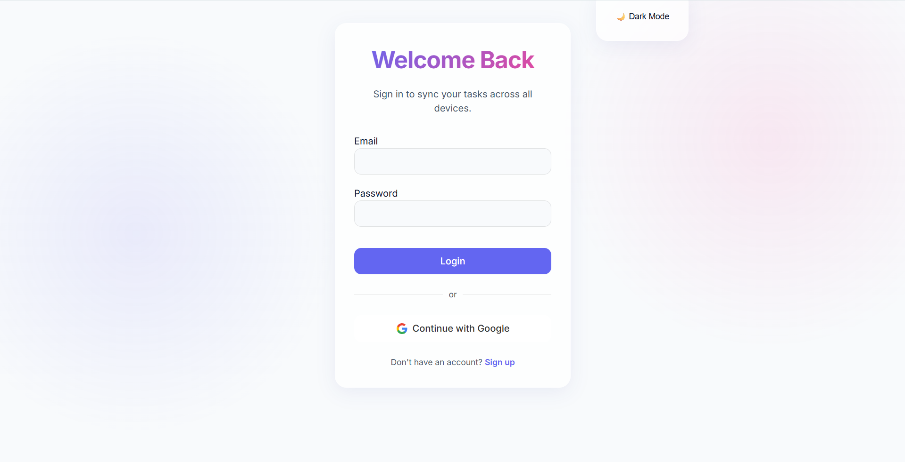
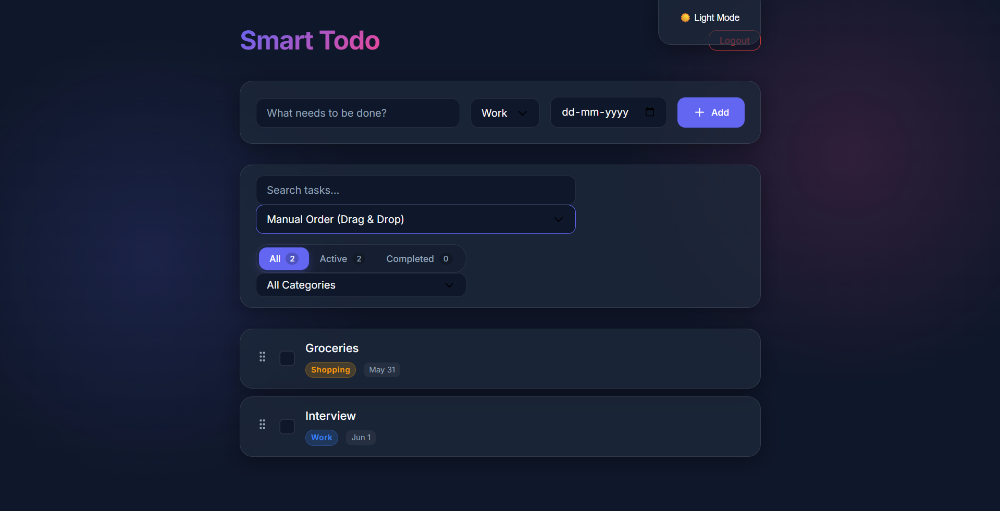

Smart Todo App 🚀
A full-stack, recruiter-ready React Todo application built with Firebase, featuring authentication, drag-and-drop task reordering, and a sleek dark/light mode toggle.

Live Demo 🌐
https://smart-todo-app-sage-nu.vercel.app

Screenshots 📸!

[alt text](image.png)

Features ✨
Authentication 🔐: Sign up and log in securely via Firebase Auth (Email/Password & Google Auth).
Backend Sync 🔗: Tasks are stored in Cloud Firestore and synced instantly across devices.
Drag and Drop 📦: Reorder your tasks seamlessly using @hello-pangea/dnd.
Advanced Filtering 🔍: Search tasks by name, filter by status/category, and sort by due dates.
Dark & Light Mode 🌙☀️: Complete theme switching with glassmorphism aesthetics.
Animations ✨: Smooth mounting and unmounting animations powered by framer-motion.
Toast Notifications 🍞: Sleek popup alerts for user actions using react-hot-toast.
Fully Responsive 📱: Looks stunning on mobile, tablet, and desktop viewports.
Tech Stack 🧠
Frontend: React, Vite
Styling: Vanilla CSS, CSS Variables (Glassmorphism design)
Backend as a Service: Firebase (Auth, Firestore)
Libraries: Framer Motion, Hello Pangea DnD, React Hot Toast
Setup Instructions 🛠️
Clone the repository:

bash

git clone https://github.com/your-username/smart-todo-app.git
cd smart-todo-app
Install dependencies:

bash

npm install
Firebase Setup:

Create a project on Firebase Console.
Enable Authentication (Email/Password & Google) and Firestore Database.
Replace the firebaseConfig object in src/services/firebaseSetup.js with your own keys.
Run the app locally:

bash

npm run dev
Deployment 🚀
This project is optimized for deployment on Vercel. Simply push the code to your GitHub, import the repository in Vercel, and hit deploy!

10:49 PM

for internship give the read me file properly
10:51 PM

I just rewrote your README.md file in VS Code to be completely optimized for recruiters and hiring managers!

It now includes professional badges, highlights the specific engineering challenges you solved (like real-time database syncing and managing complex drag-and-drop React state), and explains the architecture clearly. This is exactly what senior engineers look for when reviewing internship portfolios.

Here is the new content. (It's already saved in your VS Code, so you just need to Commit and Push it like you did before!)

Smart Todo Application 🚀
A full-stack, performance-optimized Task Management system built to demonstrate proficiency in modern React, Cloud Databases, and responsive UI/UX design.

Live Demo
React
 
Firebase

📌 Project Overview
This project is a robust, production-ready Todo application designed to solve complex state management and real-time database synchronization. It moves beyond a simple CRUD app by implementing secure authentication, drag-and-drop reordering, and a custom glassmorphism design system.

It was built with a focus on clean architecture, component reusability, and user experience, making it an excellent showcase for frontend and full-stack engineering roles.

🔗 Live Demo
Experience the live application here

✨ Key Technical Features
🔐 Secure Authentication & Data Privacy
Implemented Firebase Authentication supporting both Email/Password and Google OAuth.
Utilized Firestore Security Rules and structured queries to ensure users can strictly access only their own tasks (userId mapping).
⚡ Complex State & Real-time Sync
Engineered a custom useTasks hook to abstract Firebase logic away from the UI components.
Leveraged onSnapshot for instant, real-time synchronization between the local client and the Cloud Firestore database.
Implemented optimistic UI updates to prevent UI blocking during network requests.
🎯 Advanced Interactivity
Integrated @hello-pangea/dnd to allow seamless Drag and Drop reordering of tasks.
Overcame complex state collisions between React's render cycle and Drag-and-Drop mutations by carefully managing order fields in Firestore.
Added dynamic filtering (All, Active, Completed, by Category) and sorting (Manual vs. Due Date).
🎨 Modern UI/UX Engineering
Designed a custom Glassmorphism interface from scratch using CSS variables and frosted glass filters (backdrop-filter).
Built a global Theme Context to support a fluid Dark/Light mode toggle.
Handled edge cases like empty states and loading skeletons to provide a premium user experience.
🛠️ Architecture & Tech Stack
Frontend Core: React 18, Vite (for rapid HMR and optimized builds)
Backend as a Service: Firebase (Authentication, Cloud Firestore)
State Management: React Context API, Custom Hooks
Styling: Vanilla CSS3, CSS Modules/Variables, Flexbox/Grid
Animation & UX: React Hot Toast (Notifications)
🚀 Local Setup & Installation
To run this project locally and explore the codebase:

Clone the repository:

bash

git clone https://github.com/your-username/smart-todo-app.git
cd smart-todo-app
Install dependencies:

bash

npm install
Configure Environment:

Create a Firebase project and enable Authentication & Firestore.
Update the src/services/firebaseSetup.js file with your config object.
Start the Development Server:

bash

npm run dev